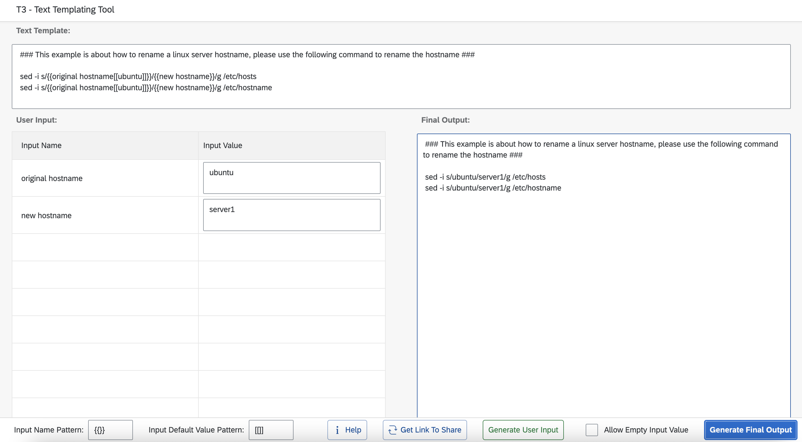

# T3 - Text Templating Tool

Simple text templating tool that turn any text template (config template, runbook template, etc) into a user friendly web form.  
No more manual find and replace. No more worries about if someone forgot to replace certain values.  
    
You can access the tool here: https://maxchen021.github.io/T3/  
If you want the ability to download text template data from url, then you will need to run your own instance via docker from the "Run your own local copy via docker" section.  
  

  


## Run your own local copy via docker
If you are using v1.0.1 or later, use the following command to run the container:
```
docker run -d -p 80:8080 maxchen021/t3
```
  
By default http access log is disabled, use the following command to run the container with the access log enabled:
```
docker run -d -p 80:8080 -e "T3_GUNICORN_ACCESSLOG=-" maxchen021/t3
```  
  
If you are using v1.0.0, use the following command to run the container:
```
docker run -d -p 80:80 maxchen021/t3:v1.0.0
```

## Nginx ingress configuration
If you are running it under kubernetes with nginx ingress, add the following config so it can handle long url:
```
nginx.ingress.kubernetes.io/server-snippet: |
  http2_max_header_size 256k;
  http2_max_field_size 256k;
```

## HTTP basic authentication support
If your text templates are hosted in a web server that require authentication and you don't want to put the credential in the url (text template input) when sharing it, it is now possible to define the credential details in the server configuration starting at v1.0.4.
You would need to define a http_auth.json file to be mounted under /etc/T3/http_auth.json so that the tool can use it to authenticate. This file is being read on each request so there is no need to restart the container after updating the file. This file should be readable by user id 1000.   

http_auth.json example:
```
{
  "example.com" : {
    "username" : "readonly-user1",
    "password" : "password1"
  },
  "example2.com" : {
    "username" : "readonly-user2",
    "password" : "password1"
  }
}
```

docker command:
```
docker run -d -p 80:8080 -v "$(pwd)"/http_auth.json:/etc/T3/http_auth.json maxchen021/t3
```

The input url for the tool is just a regular url without credential info. The tool will auto detect the domain name/server name and add the credential to the url.  
Example text template url (example.com in the url match the example.com specified in the http_auth.json example):
```
https://example.com/text-template1.txt
```