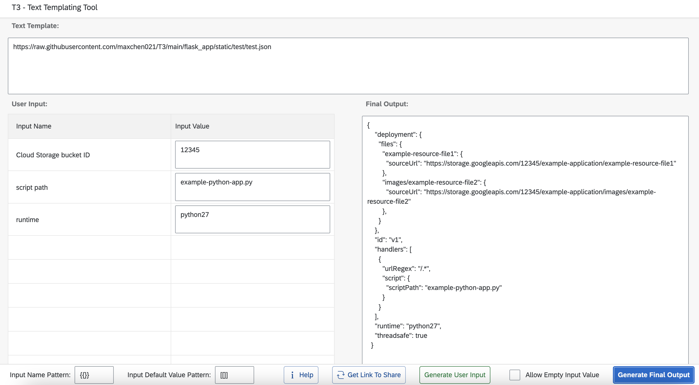

# T3 - Text Templating Tool

Simple text templating tool that turn any text template (config template, runbook template, etc) into a user friendly web form.  
No more manual find and replace. No more worries about if someone forgot to replace certain values.  
    
You can access the tool here: https://maxchen021.github.io/T3/  
If you want the ability to download text template data from url, then you will need to run your own instance via docker from the "Run your own local copy via docker" section.  
  

  


## Run your own local copy via docker
If you are using v1.0.1 or later, use the following command to run the container:
```
docker run -d -p 80:8080 maxchen021/t3
```
  
If you are using v1.0.0, use the following command to run the container:
```
docker run -d -p 80:80 maxchen021/t3:v1.0.0
```

## Nginx ingress configuration
If you are running it under kubernetes with nginx ingress, add the following config so it can handle long url:
```
nginx.ingress.kubernetes.io/server-snippet: |
  http2_max_header_size 256k;
  http2_max_field_size 256k;
```
